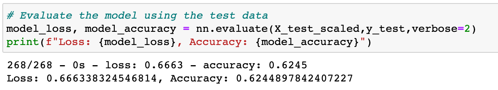

# Neural Network Charity Analysis

## Overview
This project was undertaken to help a non-profit foundation, Alphabet Soup, use Neural Network models to predict successful donation recipients. We used a dataset of over 34,000 organizations that have received funding from Alphabet Soup over the years, and built several Neural Network models to find which models better predict successful donations. We start by preprocessing the data so that it can be used in Neural Network models and then compile and train the models and evaluate the accuracy they show.  We then built several additional models, changing the data analyzed and the structure of the models in an effort to increase the accuracy they produce. 

## Resources

* Python 3.7 in Jupyter Notebook
* TensorFlow libraries
* SciKit Learn libraries
* Pandas
* VS Code

## Results
In the data preprocessing step we separated the target variable from the predictive variables and removed two variables that do not help our analyisis

* The IS_SUCCESSFUL variable is considered the target for our models
    
* We considered the following variables to be the features for our models:
    APPLICATION_TYPE, AFFILIATION, CLASSIFICATION, USE_CASE, ORGANIZATION, STATUS, INCOME, SPECIAL_CONSIDERATIONS and ASK_AMT

* We removed two variables, EIN and NAME from the dataset as they are neither targets nor features

After preprocessing the dataset, we built a basic Neural Network model, using 2 hidden layers with the 'ReLU' activation function and the 'Sigmoid' activation function on the output layer and using 80 Neurons for the first hidden layer and 30 Neurons for the second hidden layer. This model produced an accuracy of 0.624.

 

*  We then tried several combinations and iterations of compiling and training models changing the numbers of neurons, hidden layers and activation functions to improve the accuracy produced. We also attempted removing a noisy variable with a significant amount of dispersion/outliers to improve model performance. We increased the Neurons used, doubling the first hidden layer to 160 and the second hidden layer to 80 to increase the number of iterations through the data our model performed and actually saw a less favorable evaluation, with accuracy dropping to 0.601.

 

We experienced the best evaluation of accuracy when adding a third hidden layer, and keeping the neurons and activation functions in the hidden and output layers constant. This approach gave us ann accuracy of 0.667.
 

We attempted other improvements to accuracy, but found that changing the activation on the third hidden layer to the 'Tanh" function and changing the activation function on the output layer to 'SoftMax' actually lowered the accuracy of the models. In addition, we saved the models' weights every 5 epochs and saved the results of our code used to build the various models to  HDF5 files.

Below is a table of the model construction parameters and accuracy evaluation of the different attempts we made to build a model that achieves 75% accuracy.
 

* We were ultimately not able to achieve the model target predictive accuracy of 75%, although our attempts to increase performance did improve accuracy from the baseline 0.569 reading to 0.667 in the best performing model.

* Steps taken to try and increase model performance:
    * dropping variables/features
    * adding neurons
    * adding hidden layers
    * changing activation in hidden layer 
    * changing activation in output layer

## Summary 

While we did not achieve the target model predictive accuracy of 75%, our efforts did find that using more Neurons (160/60/40) and three hidden layers produced the best results from our attempts. In order to achieve the 75% target predictive accuracy we could try reducing the variability of the 'ASK_AMT' data to filter out some of the outliers that make this data noisy, instead of dropping ASK_AMT entirely.
We could also try a Random Forrest Classifier model on our dataset, because it may provide higher accuracy and lower prediction error without over-fitting the model.

